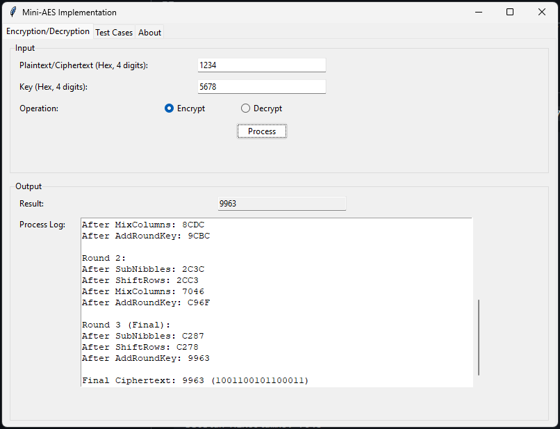
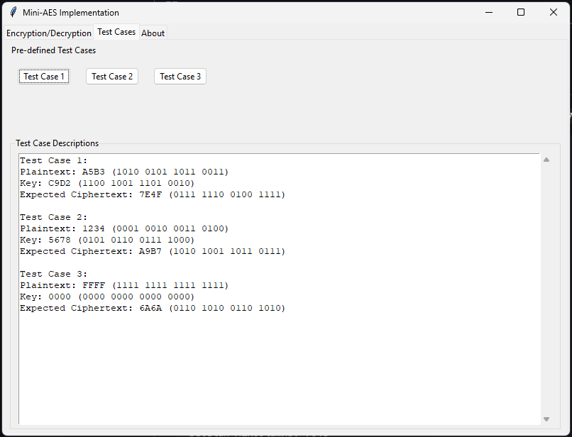

# Dokumentasi Mini-AES

## Anggota Kelompok
- Subkhan Masudi - 5027221044
- Irfan Qobus Salim - 5027221058
- Hafiz Akmaldi Santosa - 5027221061
- Atha Rahma A - 5027221030
- Angela Christie - 5027221047

## Pendahuluan

Dokumen ini menjelaskan implementasi Mini-AES, versi sederhana dari Advanced Encryption Standard (AES) yang dirancang untuk tujuan pembelajaran. Mini-AES mempertahankan struktur inti AES tetapi beroperasi pada ukuran blok dan kunci yang lebih kecil untuk memudahkan pemahaman algoritma.

## Spesifikasi Algoritma Mini-AES

Mini-AES memiliki spesifikasi sebagai berikut:
- **Ukuran Blok**: 16-bit (4 nibble)
- **Ukuran Kunci**: 16-bit (4 nibble)
- **Jumlah Ronde**: 3
- **Representasi State**: Array 2x2 dari nibble (nilai 4-bit)
- **Operasi**: SubNibbles, ShiftRows, MixColumns, AddRoundKey
- **Operasi Lapangan**: Berbasis pada GF(2^4) dengan polinomial x^4 + x + 1

### Komponen Utama

#### 1. SubNibbles
Operasi ini menggantikan setiap nibble 4-bit dengan nilai lain sesuai dengan S-Box 4-bit yang telah ditentukan. S-Box memberikan efek confusion (kebingungan) dalam cipher dengan menciptakan hubungan non-linear antara kunci dan ciphertext.

S-Box (Heksadesimal):
```
[0x9, 0x4, 0xA, 0xB, 0xD, 0x1, 0x8, 0x5, 0x6, 0x2, 0x0, 0x3, 0xC, 0xE, 0xF, 0x7]
```

Inverse S-Box (untuk dekripsi):
```
[0xA, 0x5, 0x9, 0xB, 0x1, 0x7, 0x8, 0xF, 0x6, 0x0, 0x2, 0x3, 0xC, 0x4, 0xD, 0xE]
```

#### 2. ShiftRows
Dalam Mini-AES, state disusun sebagai matriks 2x2 dari nibble. Operasi ShiftRows membiarkan baris pertama tidak berubah tetapi menukar posisi nibble di baris kedua:

```
[n0, n1]    [n0, n1]
[n2, n3] -> [n3, n2]
```

#### 3. MixColumns
Operasi ini memberikan efek diffusion (difusi) dengan mencampur kolom-kolom dari matriks state. Setiap kolom diperlakukan sebagai polinomial atas GF(2^4) dan dikalikan dengan polinomial tetap. Dalam Mini-AES, kita menggunakan matriks 2x2 yang disederhanakan:

```
Matriks MixColumns:
[0x1, 0x4]
[0x4, 0x1]
```

Matriks Inverse MixColumns:
```
[0x9, 0x2]
[0x2, 0x9]
```

#### 4. AddRoundKey
Operasi ini melakukan XOR sederhana antara state dan round key. Ini adalah satu-satunya operasi yang memasukkan kunci ke dalam proses enkripsi.

#### 5. Key Expansion
Algoritma expansion key menghasilkan round key dari kunci awal. Untuk Mini-AES dengan 3 ronde, kita perlu menghasilkan 4 round key (termasuk kunci awal). Prosesnya melibatkan rotasi, substitusi dengan S-Box, dan XOR dengan konstanta ronde.

## Flowchart

### Enkripsi Mini-AES

```
MULAI
  |
  v
Inisialisasi state dengan plaintext
  |
  v
Hasilkan round key dari kunci awal
  |
  v
AddRoundKey (Ronde 0)
  |
  v
UNTUK ronde = 1 hingga 2:
  |  |
  |  v
  |  SubNibbles
  |  |
  |  v
  |  ShiftRows
  |  |
  |  v
  |  MixColumns
  |  |
  |  v
  |  AddRoundKey
  |
  v
SubNibbles (Ronde Final)
  |
  v
ShiftRows (Ronde Final)
  |
  v
AddRoundKey (Ronde Final)
  |
  v
Output ciphertext
  |
  v
SELESAI
```

### expansion key

```
MULAI
  |
  v
Inisialisasi round_keys[0] = kunci awal
  |
  v
UNTUK i = 0 hingga 2:
  |  |
  |  v
  |  Rotasi dua nibble terakhir dari kunci sebelumnya
  |  |
  |  v
  |  Terapkan S-Box ke semua nibble
  |  |
  |  v
  |  XOR nibble pertama dengan konstanta ronde
  |  |
  |  v
  |  XOR dengan round key sebelumnya
  |  |
  |  v
  |  Simpan sebagai round key baru
  |
  v
Kembalikan semua round key
  |
  v
SELESAI
```

## Detail Implementasi

### Struktur Program

Implementasi terdiri dari tiga kelas utama:
1. `MiniAES`: Implementasi inti algoritma Mini-AES
2. `MiniAESApp`: Aplikasi GUI untuk enkripsi/dekripsi
3. `BlockModeMiniAES`: Implementasi mode ECB dan CBC

### Test Case

Implementasi ini mencakup tiga test case untuk memverifikasi operasi yang benar:

1. **test case 1**:
   - Plaintext: A5B3 (1010 0101 1011 0011)
   - Kunci: C9D2 (1100 1001 1101 0010)
   - Ciphertext yang Diharapkan: 7E4F (0111 1110 0100 1111)

2. **test case 2**:
   - Plaintext: 1234 (0001 0010 0011 0100)
   - Kunci: 5678 (0101 0110 0111 1000)
   - Ciphertext yang Diharapkan: 9963 (1001 1001 0110 0011)

3. **test case 3**:
   - Plaintext: FFFF (1111 1111 1111 1111)
   - Kunci: 0000 (0000 0000 0000 0000)
   - Ciphertext yang Diharapkan: 6A6A (0110 1010 0110 1010)

### Mode Operasi Blok

Implementasi ini mendukung dua mode operasi blok:

1. **Electronic Codebook (ECB)**: Setiap blok dienkripsi secara independen.
2. **Cipher Block Chaining (CBC)**: Setiap blok di-XOR dengan blok ciphertext sebelumnya sebelum dienkripsi.

### GUI

GUI menyediakan:
- Kolom input untuk plaintext/ciphertext dan kunci
- Tombol radio untuk memilih enkripsi atau dekripsi
- Tombol proses untuk melakukan operasi
- Tampilan output untuk hasil
- Area log yang menampilkan proses secara detail
- Tab untuk menjalankan test case
- Tab tentang dengan informasi tentang implementasi

## Analisis: Kelebihan dan Keterbatasan Mini-AES

### Kelebihan:
1. **Nilai Edukatif**: Mini-AES menyediakan representasi yang disederhanakan tetapi strukturnya akurat dari AES, menjadikannya berharga untuk mempelajari prinsip-prinsip kriptografi.
2. **Kemiripan Struktural**: Mempertahankan operasi inti AES (SubBytes, ShiftRows, MixColumns, AddRoundKey) sambil menyederhanakannya.
3. **Efisiensi Komputasi**: Jauh lebih cepat untuk dihitung daripada AES penuh karena ukuran blok dan kunci yang lebih kecil, menjadikannya cocok untuk demonstrasi.
4. **Mengilustrasikan Prinsip Cipher Blok**: Mendemonstrasikan konsep-konsep dasar seperti confusion, diffusion, dan struktur jaringan Feistel.

### Keterbatasan:
1. **Keamanan**: Mini-AES TIDAK aman untuk enkripsi di dunia nyata. Ukuran blok dan kunci 16-bit rentan terhadap:
   - Serangan brute force (hanya 2^16 kemungkinan kunci)
   - Analisis statistik karena ukuran blok yang kecil
   - Serangan known-plaintext
2. **Difusi Terbatas**: Dengan matriks state hanya 2x2, difusi jauh lebih terbatas dibandingkan dengan AES penuh.
3. **S-Box yang Disederhanakan**: S-Box 4-bit memberikan confusion yang lebih sedikit dibandingkan dengan S-Box 8-bit dalam AES.
4. **Lebih Sedikit Ronde**: Hanya 3 ronde dibandingkan dengan 10, 12, atau 14 dalam AES, mengurangi margin keamanan.

## Contoh Proses Enkripsi

Berikut adalah contoh proses enkripsi untuk plaintext `1234` dengan kunci `5678`:

```
Plaintext: 1234 (0001001000110100)
Kunci: 5678 (0101011001111000)

expansion key:
Round Key 0: 5678
Round Key 1: 1060
Round Key 2: B929
Round Key 3: 5B1B

Initial AddRoundKey: 444C (1234 ⊕ 5678)

Ronde 1:
Setelah SubNibbles: DDDC
Setelah ShiftRows: DDCD
Setelah MixColumns: 8CDC
Setelah AddRoundKey: 9CBC (8CDC ⊕ 1060)

Ronde 2:
Setelah SubNibbles: 2C3C
Setelah ShiftRows: 2CC3
Setelah MixColumns: 7046
Setelah AddRoundKey: C96F (7046 ⊕ B929)

Ronde 3 (Final):
Setelah SubNibbles: C287
Setelah ShiftRows: C278
Setelah AddRoundKey: 9963 (C278 ⊕ 5B1B)

Ciphertext Final: 9963 (1001100101100011)
```
## Dokumentasi GUI

### Proses Enkripsi


### Proses Dekripsi


### Test Case


## Kesimpulan

Mini-AES berfungsi sebagai alat edukasi yang sangat baik untuk memahami prinsip-prinsip cipher blok modern. Ini menangkap esensi AES sambil cukup sederhana untuk ditelusuri secara manual. Meskipun tidak cocok untuk aplikasi kriptografi yang sebenarnya, Mini-AES memberikan wawasan berharga tentang bagaimana AES dan cipher blok serupa bekerja.

Implementasi ini tidak hanya mencakup algoritma dasar Mini-AES tetapi juga memperluas ke mode operasi blok (ECB dan CBC) dan menyertakan GUI untuk pembelajaran interaktif. Kemampuan dekripsi tambahan memungkinkan pengguna untuk mengamati siklus enkripsi-dekripsi secara lengkap, memperkuat pemahaman tentang prinsip-prinsip kriptografi yang terlibat.